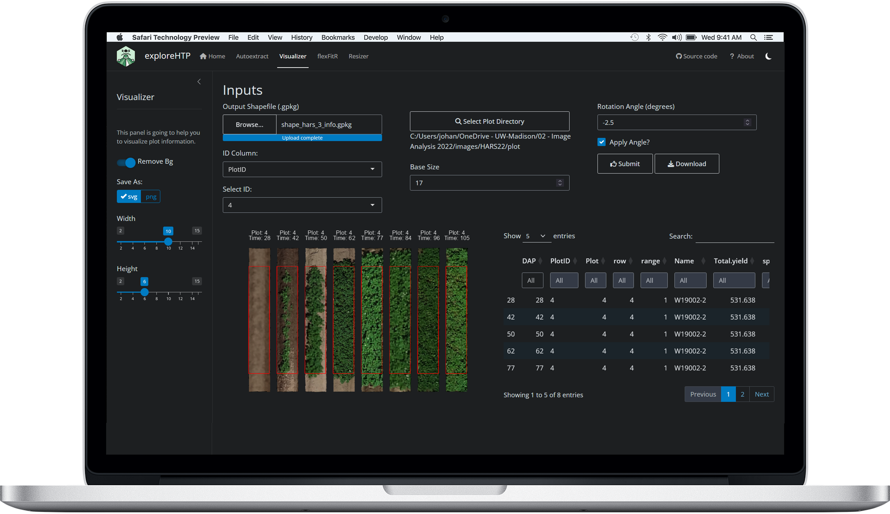

<!-- README.md is generated from README.Rmd. Please edit that file -->

```{r, include = FALSE}
knitr::opts_chunk$set(
  collapse = TRUE,
  comment = "#>",
  fig.path = "man/figures/README-",
  out.width = "100%"
)
```

# `{exploreHTP}` 

<!-- badges: start -->
[](https://lifecycle.r-lib.org/articles/stages.html#stable)
<!-- badges: end -->


`{exploreHTP}` is an R Shiny application designed to support the processing and analysis of high-throughput phenotyping data obtained from UAV imagery.


## Installation

You can install the development version of `{exploreHTP}` from GitHub using:

```r
# install.packages("pak")
pak::pkg_install("AparicioJohan/exploreHTP")
```

## Video tutorials

Video tutorials are available to guide users through the installation and use of `{exploreHTP}`.

### Installing exploreHTP for UAV imagery analysis

The following tutorial shows how to find the official repository, install `{exploreHTP}`, and launch the application for the first time.

<a href="https://www.youtube.com/watch?v=KU7hV4GcXZk">
  
</a>

[Watch the installation tutorial on YouTube](https://www.youtube.com/watch?v=KU7hV4GcXZk)

Additional tutorials will be added as they become available.

## Run

You can launch the application by running:

```{r, eval = FALSE}
library(exploreHTP)
run_app()
```



<br>
<br>


## Getting help and reporting issues

Questions, bug reports, feature requests, and suggestions are welcome through the GitHub Issues page.

Before submitting a new issue:

1. Search the [existing issues](https://github.com/AparicioJohan/exploreHTP/issues) to check whether the problem has already been reported.
2. Confirm that you are using the most recent version of `{exploreHTP}`.
3. Restart R and verify that the problem can be reproduced.
4. Prepare a small reproducible example whenever possible.

[Browse existing issues](https://github.com/AparicioJohan/exploreHTP/issues)

[Submit a new issue](https://github.com/AparicioJohan/exploreHTP/issues/new/choose)

## About

You are reading the documentation for version: `r golem::pkg_version()`

This README was compiled on:

```{r}
Sys.time()
```
