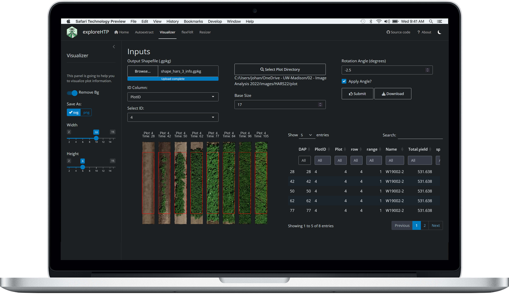

<!-- README.md is generated from README.Rmd. Please edit that file -->

# `{exploreHTP}` 

<!-- badges: start -->

[](https://lifecycle.r-lib.org/articles/stages.html#experimental)
<!-- badges: end -->

## Installation

You can install the development version of `{exploreHTP}` like so:

``` r
# install.packages("devtools")
devtools::install_github("AparicioJohan/exploreHTP")
```

## Run

You can launch the application by running:

``` r
library(exploreHTP)
run_app()
```



<br> <br>


## About

You are reading the doc about version : 1.0.0

This README has been compiled on the

``` r
Sys.time()
#> [1] "2025-05-01 15:35:24 CDT"
```
